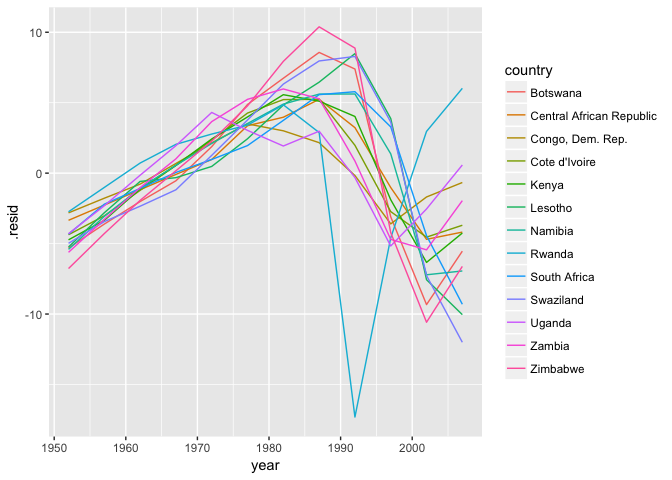

Organize with List Columns
================

<!-- This file by Charlotte Wickham is licensed under a Creative Commons Attribution 4.0 International License, adapted from the orignal work at https://github.com/rstudio/master-the-tidyverse by RStudio. -->
``` r
library(tidyverse)
library(gapminder)
library(broom)

nz <- gapminder %>%
  filter(country == "New Zealand")
us <- gapminder %>%
  filter(country == "United States")
```

Your turn 1
-----------

How has life expectancy changed in other countries? Make a line plot of lifeExp vs. year grouped by country.
Set alpha to 0.2, to see the results better.

``` r
gapminder %>% 
  ggplot(mapping = aes(x = year, y = lifeExp, group = country)) +
    geom_line(alpha = 0.2)
```


Quiz
----

How is a data frame/tibble similar to a list?

``` r
gapminder_sm <- gapminder[1:5, ]
```

It is a list! Columns are like elements of a list

You can extract them with `$` of `[[`

``` r
gapminder_sm$country
```

    ## [1] Afghanistan Afghanistan Afghanistan Afghanistan Afghanistan
    ## 142 Levels: Afghanistan Albania Algeria Angola Argentina ... Zimbabwe

``` r
gapminder_sm[["country"]]
```

    ## [1] Afghanistan Afghanistan Afghanistan Afghanistan Afghanistan
    ## 142 Levels: Afghanistan Albania Algeria Angola Argentina ... Zimbabwe

Or get a new smaller list with `[`:

``` r
gapminder_sm["country"]
```

    ## # A tibble: 5 x 1
    ##   country    
    ##   <fct>      
    ## 1 Afghanistan
    ## 2 Afghanistan
    ## 3 Afghanistan
    ## 4 Afghanistan
    ## 5 Afghanistan

Quiz
----

If one of the elements of a list can be another list, can one of the columns of a data frame be another list?

**Yes!**.

``` r
tibble(
  num = c(1, 2, 3),
  cha = c("one", "two", "three"),
  listcol = list(1, c("1", "two", "FALSE"), FALSE)
)
```

    ## # A tibble: 3 x 3
    ##     num cha   listcol  
    ##   <dbl> <chr> <list>   
    ## 1  1.00 one   <dbl [1]>
    ## 2  2.00 two   <chr [3]>
    ## 3  3.00 three <lgl [1]>

And we call it a **list column**.

Your turn 2
-----------

Run this chunk:

``` r
gapminder_nested <- gapminder %>%
  group_by(country) %>%
  nest()

fit_model <- function(df) lm(lifeExp ~ year, data = df)

gapminder_nested <- gapminder_nested %>% 
  mutate(model = map(data, fit_model))

get_rsq <- function(mod) glance(mod)$r.squared

gapminder_nested <- gapminder_nested %>% 
  mutate(r.squared = map_dbl(model, get_rsq))
```

Then filter `gapminder_nested` to find the countries with r.squared less than 0.5.

``` r
gapminder_nested %>% 
  filter(r.squared < 0.5)
```

    ## # A tibble: 13 x 4
    ##    country                  data              model    r.squared
    ##    <fct>                    <list>            <list>       <dbl>
    ##  1 Botswana                 <tibble [12 × 5]> <S3: lm>    0.0340
    ##  2 Central African Republic <tibble [12 × 5]> <S3: lm>    0.493 
    ##  3 Congo, Dem. Rep.         <tibble [12 × 5]> <S3: lm>    0.348 
    ##  4 Cote d'Ivoire            <tibble [12 × 5]> <S3: lm>    0.283 
    ##  5 Kenya                    <tibble [12 × 5]> <S3: lm>    0.443 
    ##  6 Lesotho                  <tibble [12 × 5]> <S3: lm>    0.0849
    ##  7 Namibia                  <tibble [12 × 5]> <S3: lm>    0.437 
    ##  8 Rwanda                   <tibble [12 × 5]> <S3: lm>    0.0172
    ##  9 South Africa             <tibble [12 × 5]> <S3: lm>    0.312 
    ## 10 Swaziland                <tibble [12 × 5]> <S3: lm>    0.0682
    ## 11 Uganda                   <tibble [12 × 5]> <S3: lm>    0.342 
    ## 12 Zambia                   <tibble [12 × 5]> <S3: lm>    0.0598
    ## 13 Zimbabwe                 <tibble [12 × 5]> <S3: lm>    0.0562

Your Turn 3
-----------

Edit the code in the chunk provided to instead find and plot countries with a slope above 0.6 years/year.

``` r
get_slope <- function(mod) {
  tidy(mod) %>% filter(term == "year") %>% pull(estimate)
}

# Add new column with r-sqaured
gapminder_nested <- gapminder_nested %>% 
  mutate(slope = map_dbl(model, get_slope))

# filter out low r-squared countries
big_slope <- gapminder_nested %>% 
  filter(slope > 0.6)

# unnest and plot result
unnest(big_slope, data) %>%
  ggplot(aes(x = year, y = lifeExp)) + 
    geom_line(aes(color = country))
```


Your Turn 4
-----------

**Challenge:**

1.  Create your own copy of `gapminder_nested` and then add one more list column: `output` which contains the output of `augment()` for each model.

2.  Plot the residuals against time for the countries with small r-squared.

``` r
charlotte_gapminder <- gapminder_nested

charlotte_gapminder %>%
  mutate(output = model %>% map(augment)) %>%
  unnest(output) %>%
  filter(r.squared < 0.5) %>%
  ggplot() + 
    geom_line(aes(year, .resid, color = country))
```



Take away
=========
